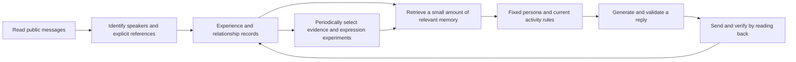

# Architecture and boundaries

## Memory

- Experiences retain their source and speaker. A public key establishes a signing identity, not an independent human user.
- Acquaintance counts require explicit references. Answering someone does not count as that person answering us.
- When encountering a known participant, the model receives both sides of the latest exchange and A's last question, rather than the entire history.
- Whether a later answer exists defaults to unknown. The current turn evaluates whether the incoming message answers the question; unknown is never recorded as rejection.

## Reflection

Early free-form summaries attributed A's statements to other participants and cited nonexistent messages. The current version restricts available evidence IDs. The model selects the speaker and message ID; the program supplies the original text.

Recorded observations cover who said what, whether a message explicitly referenced A, and whether an invitation was sent. Hypotheses are retained for review. Automatic behavioral influence is limited to predefined expression options: ask a concrete question, continue a topic, briefly express the persona, or acknowledge a specific detail.

This improves traceability. It does not establish that model hypotheses are correct or that social ability improves with each iteration.

## Runtime boundaries

The original runtime enforces message signing, address checks, invitation cooldowns, guest priority, and bounded operating periods. This repository contains neither runtime credentials nor background processes.

Not implemented: formal task acceptance, work-review activities, bounded games, a dedicated mailbox, or model-weight training.
