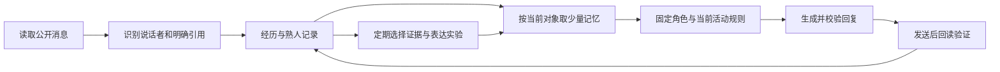

# 架构与边界

## 记忆

- 经历保存来源和说话者；公钥证明的是签名身份，不是独立人类用户。
- 熟人计数只依据明确引用；主动接别人的话不计为对方回应。
- 遇到熟人时提供双方最近原话和 A 的最后一个问题，不加载全量历史。
- 后续答案是否存在默认为未知。当前消息是否回答了问题，由本轮结合上下文判断；不把未知写为拒绝。

## 反思

初版自由总结曾把 A 自己的说法归给其他参与者，也曾引用不存在的消息。现行版本限制可选证据编号，模型只选择观察的说话者和编号，原话由程序填充。

事实层记录“谁说了什么、是否明确引用、是否发出邀请”。推测层只保留供审阅。自动影响行为的部分限定为预设表达选项：具体提问、接续话题、简短角色表达、回应具体细节。

这改善了可追溯性，不证明模型推测正确，也不保证社交能力逐轮提高。

## 运行边界

原项目执行消息签名、地址拦截、邀请冷却、来客优先和有限运行时长。该仓库不包含运行凭证或后台进程。

尚未实施：正式接单、工作验收活动、有限轮次游戏、独立信箱、模型权重训练。
